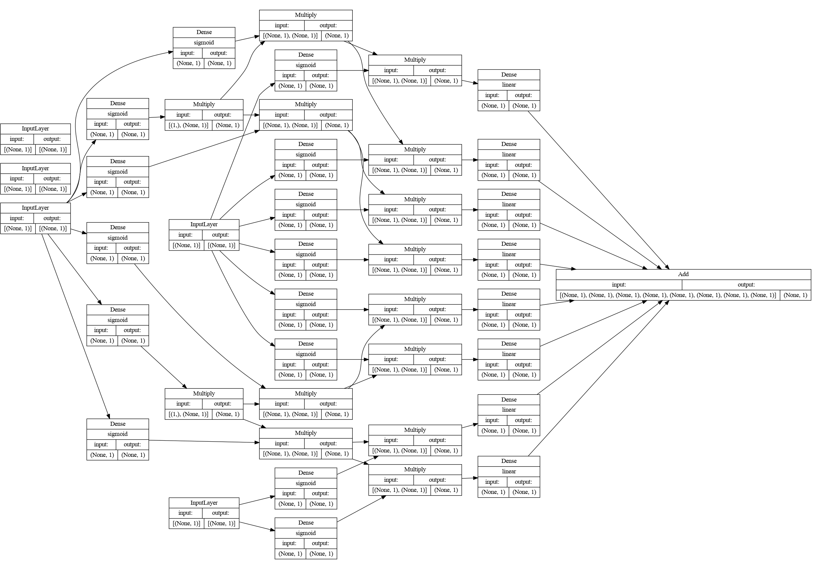

[](https://github.com/Dobiasd/treebomination/actions)
[][license]

[license]: LICENSE

**Disclaimer: This is just a fun experiment, I conducted for my own curiosity and entertainment. It's not intended to be useful for anything else.**

# treebomination

Treebomination is a way to convert a `sklearn.tree.DecisionTreeRegressor` into a (roughly) equivalent `tf.keras.Model`.

## When is this helpful?

- You irrationally dislike decision trees (e.g., for their stepwise behavior) and feel neural networks (with their smoothness) are much cooler. 🤪
- You want to prove a point about neural networks. 👨‍🏫
- You think that converting the tree to a NN and then fine-tuning it might decrease the value of your less metric on your test set. 🪄
- You have a well-working decision tree but want to only use TensorFlow or [frugally-deep](https://github.com/Dobiasd/frugally-deep) in production. 💾
- You want to back up the claims of your marketing department about your team using "AI". 👨‍💼

## When is not useful?

- You care about the performance of your predictions. 🐌
- You care about the precision of your results. 🏹
- You care about the size of your final application. 🦏

So, **it is highly recommended to not actually use this for anything serious**.

If you seriously consider replacing trees with NNs, I recommend having a look at the following projects instead:
- https://github.com/charliec443/TreeGrad
- https://github.com/microsoft/hummingbird
- https://github.com/tensorflow/decision-forests

## Usage

```bash
from sklearn.tree import DecisionTreeRegressor
from treebomination import treebominate

my_decision_tree_regressor = DecisionTreeRegressor()
# ... training ...
model = treebominate(my_decision_tree_regressor)
```

## Origin story

From some unbridled thoughts:

- A Decision tree is a fancy way of having nested `if` statements.
- A simple logistic regression on a one-dimensional input acts like a fuzzy threshold (or an `if` statement).
- A neuron in an artificial neural network acts can act as a single logistic regression node.

The following idea arose: There should be a morphism from binary decision trees to neural networks,
it should™️ be possible to emulate every decision tree with a neural network,
i.e., derive the network architecture from the tree and initialize the weights and biases
such that the output of the network is similar to the output of the tree.

## Structure of the generated neural networks

There might be much more intelligent ways to "encode" a decision tree as a neural network,
but treebomination uses the following approach.

Each decision node from the tree is simulated by two neurons
(each one represented as a dense layer with a singleton shape).
The threshold-ish behavior results from the neuron having a very high input weight (steep and "sudden" sigmoid)
and the bias chosen such that the "middle" of the sigmoid falls into the (scaled) threshold value.
The output values (booleans, encoded as fuzzy 0 and 1) signal if this path of the tree is taken.
For subsequent neurons, this incoming signal is multiplied onto their output value, such that
not-taken paths are silenced for further output.
The final "leaf" neurons use linear activation, have a bias of `0`,
and their initial weight set to the intended output value.
Since only one of these final neurons gets an input signal, their outputs can be combined by summing them up.

Initializing the neural network this way makes it output (almost) the exact same predictions as the tree does.

So a simple three like this


results in the following NN: 


A `DecisionTreeRegressor` with a higher `max_depth` (`3` in the case below) like the following:

```
|--- feature_3 <= 7.50
|   |--- feature_3 <= 6.50
|   |   |--- feature_15 <= 1131.50
|   |   |   |--- value: [115593.60]
|   |   |--- feature_15 >  1131.50
|   |   |   |--- value: [149818.43]
|   |--- feature_3 >  6.50
|   |   |--- feature_15 <= 2093.50
|   |   |   |--- value: [197758.96]
|   |   |--- feature_15 >  2093.50
|   |   |   |--- value: [284680.23]
|--- feature_3 >  7.50
|   |--- feature_3 <= 8.50
|   |   |--- feature_15 <= 1928.00
|   |   |   |--- value: [250284.08]
|   |   |--- feature_15 >  1928.00
|   |   |   |--- value: [314964.80]
|   |--- feature_3 >  8.50
|   |   |--- feature_31 <= 517.50
|   |   |   |--- value: [372716.17]
|   |   |--- feature_31 >  517.50
|   |   |   |--- value: [745000.00]
```

results in a ridiculously complex neural-network architecture.



In reality, trees are often much deeper than that, which not only results in a very large (and slow) model,
but also the precision of the results suffers.

But hey, at least in this toy example (trained on the numerical features from
the [Kaggle competition "House Prices - Advanced Regression Techniques"](https://www.kaggle.com/competitions/house-prices-advanced-regression-techniques),
see [tests](treebomination/tests.py))
the R2 score of the NN (`0.766`), is slightly higher than the one of the tree (`0.765`).
With a quick re-training on the same data, it even improves a bit more (to `0.770`). 🎉