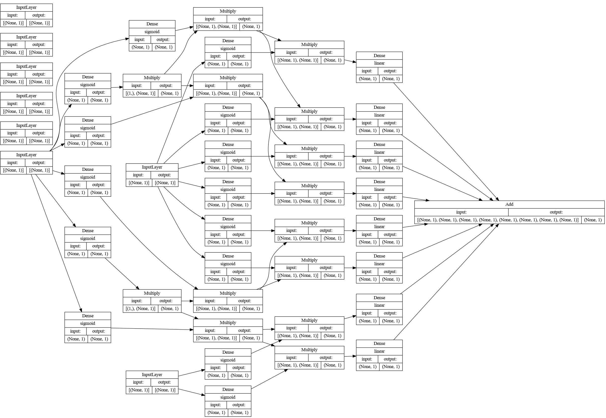

[](https://github.com/Dobiasd/treebomination/actions)
[][license]

[license]: LICENSE

# treebomination

Treebomination is a way to convert a `sklearn.tree.DecisionTreeRegressor` into a (roughly) equivalent `tf.keras.Model`.

## When is this helpful?

- You irrationally dislike decision trees and feel neural networks are much cooler.
- You want to prove a point about neural networks.
- You think that converting the tree to a NN and then fine-tuning it might decrease the value of your less metric on your test set.
- You have a well-working decision tree but want to only use TensorFlow or [frugally-deep](https://github.com/Dobiasd/frugally-deep) in production.
- You want to back up the claims of your marketing department about your team using "AI".

## When is not useful?
- You care about the performance of your predictions.
- You care about the precision of your results.
- You care about the size of your final application.

So, **I highly recommend not actually using this for anything serious**.

## Usage

```bash
from sklearn.tree import DecisionTreeRegressor
from treebomination import treebominate

my_decision_tree_regressor = DecisionTreeRegressor()
# ... training ...
model = treebominate(my_decision_tree_regressor)
```

## Origin story

From some unbridled thoughts:
- A Decision tree is a fancy way of having nested `if` statements.
- A simple logistic regression on a one-dimensional input acts like a fuzzy threshold (or an `if` statement).
- A neuron in an artificial neural network acts can act as a single logistic regression node.

The following idea arose: There should be a morphism from binary decision trees to neural networks, it should™️ be possible to emulate every decision tree with a neural network, i.e., derive the network architecture from the tree and initialize the weights and biases such that the output of the network is similar to the output of the tree.

## Structure of the generated neural networks

There might be much more intelligent ways to "encode" a decision tree as a neural network, but treebomination uses the following approach.

Even a very simple (`max_depth=3`) `DecisionTreeRegressor` like the following:

```
|--- feature_3 <= 7.50
|   |--- feature_3 <= 6.50
|   |   |--- feature_15 <= 1131.50
|   |   |   |--- value: [115593.60]
|   |   |--- feature_15 >  1131.50
|   |   |   |--- value: [149818.43]
|   |--- feature_3 >  6.50
|   |   |--- feature_15 <= 2093.50
|   |   |   |--- value: [197758.96]
|   |   |--- feature_15 >  2093.50
|   |   |   |--- value: [284680.23]
|--- feature_3 >  7.50
|   |--- feature_3 <= 8.50
|   |   |--- feature_15 <= 1928.00
|   |   |   |--- value: [250284.08]
|   |   |--- feature_15 >  1928.00
|   |   |   |--- value: [314964.80]
|   |--- feature_3 >  8.50
|   |   |--- feature_31 <= 517.50
|   |   |   |--- value: [372716.17]
|   |   |--- feature_31 >  517.50
|   |   |   |--- value: [745000.00]
```

results in a ridiculously complex neural-network architecture.  



In reality, trees are often much deeper than that, which not only results in a very large (and slow) model, but also the precision of the results suffers.

But hey, at least in this toy example
(trained on the numerical features from the [Kaggle competition "House Prices - Advanced Regression Techniques"](https://www.kaggle.com/competitions/house-prices-advanced-regression-techniques))
the R2 score of the NN tree (`0.692`), is slightly higher than the one of the tree (`0.690`).
With a quick re-training on the same data, it even improves a bit more (to `0.694`).